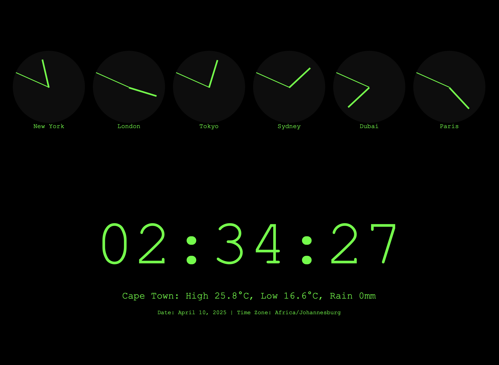

# Old-School Clock Radio with Weather Info

This project is a web-based old-school clock radio interface that displays:

- A digital clock with a black background and green characters.
- Six analogue clocks for different cities (New York, London, Tokyo, Sydney, Dubai, and Paris).
- A footer showing the current weather information for Cape Town, including:
  - Current temperature (in parentheses).
  - Daily high and low temperatures.
  - Rainfall in millimeters.
- A second footer displaying the current date, month, year, and time zone.

## Features

1. **Digital Clock**:
   - Displays the current time in `HH:MM:SS` format.
   - Centered on the page with a retro green-on-black style.

2. **Analogue Clocks**:
   - Six analogue clocks representing different time zones.
   - Positioned in a clustered layout at the top of the page.
   - Styled with a semi-transparent white background.

3. **Cape Town Weather**:
   - Fetches real-time weather data using the [Open-Meteo API](https://open-meteo.com/).
   - Displays high, low, and rainfall data for the current day.

4. **Date and Time Zone Footer**:
   - Displays the current date, month, year, and time zone.
   - Styled with a smaller font for better visual balance.

## Screenshot

## How to Run

1. Clone the repository or download the project files.
2. Open the `clock.html` file in any modern web browser.
3. Ensure you have an active internet connection to fetch the weather data.

## Dependencies

- **Open-Meteo API**: Used to fetch real-time weather data for Cape Town.

## File Structure

- `clock.html`: Contains all the HTML, CSS, and JavaScript for the project.
- `assets/`: Contains project assets, including screenshots.

## Customization

- To add more analogue clocks, duplicate the existing clock container in the `<header>` section and update the city name and time zone offset in the JavaScript.
- To change the weather location, update the latitude and longitude in the `fetchCapeTownWeather` function.

## Known Issues

- If the weather API fails, the footer will display an error message.
- The analogue clocks do not include second hands for simplicity.

## License

This project is open-source and available under the MIT License.